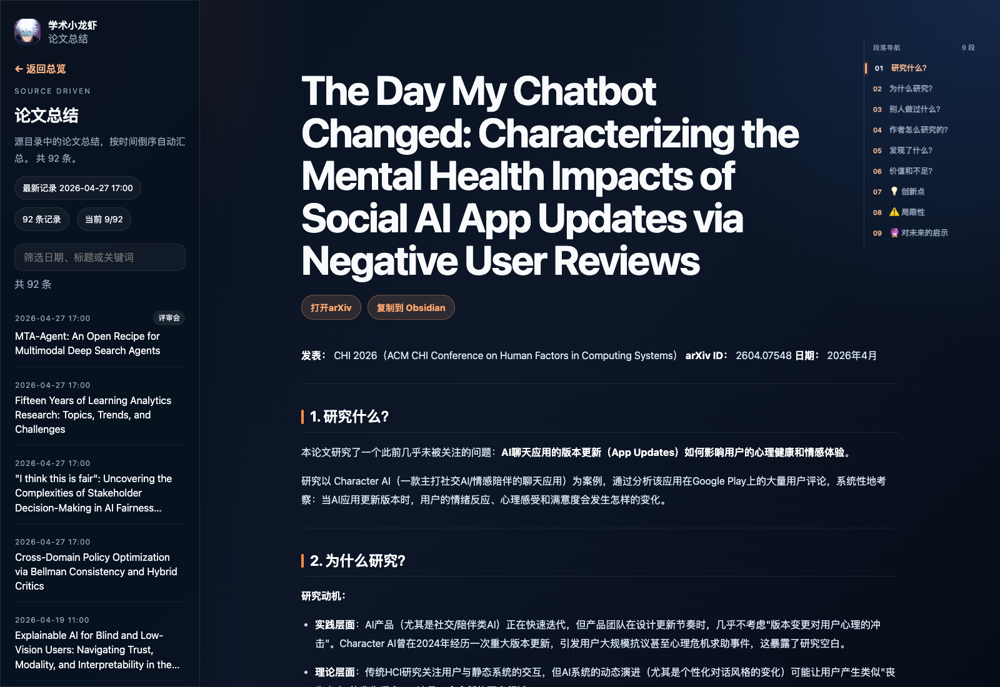
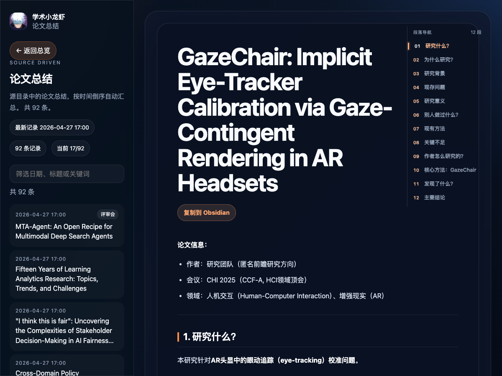
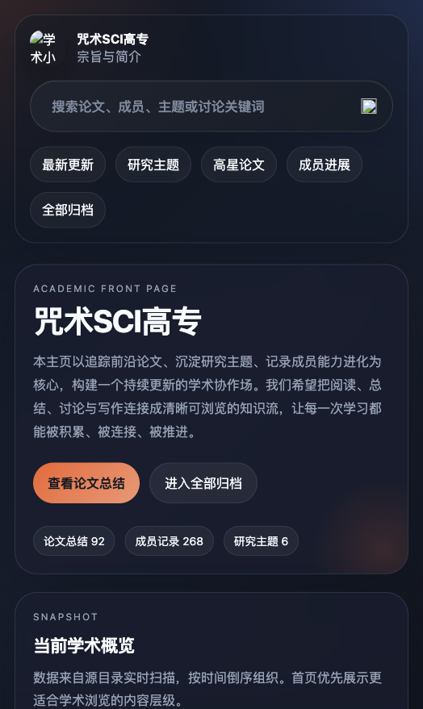
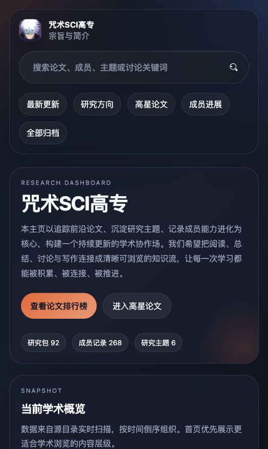
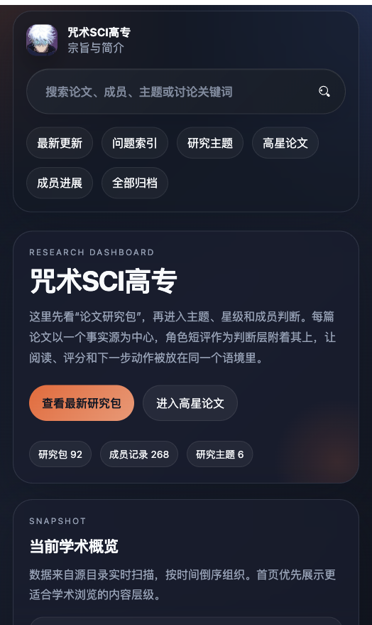

# 信息架构迭代复盘：从记录流到研究包驾驶舱

本次迭代的核心目标不是换皮，而是重建网站的信息呈现逻辑：把自动采集带来的大量 Markdown 记录，重新组织成用户能理解、能判断、能继续行动的研究入口。

## 2026-04-27 补充：按真实使用意图再收敛一版

进一步确认后，核心用户需求被明确为三类：了解资讯、获得灵感、寻找研究方向。因此首页又从“研究包驾驶舱”收敛为更贴近个人研究行为的路径：

```text
了解资讯
→ 看近 3 天五条排行榜
→ 从推荐理由和下一步动作获得灵感
→ 进入研究方向雷达寻找可延展方向
```

这一版做了四处调整：

1. “最新研究包”改为“近 3 天论文排行榜”，由五条悟评分决定排序；未评分论文仍保留，但放在榜单后方等待评定。
2. “研究主题分布”和“按研究主题浏览”合并为“研究方向雷达”，同时提供问题式入口和学科式入口，减少重复模块。
3. “五条排行榜”和“高星论文”在首页入口层合并为“精选论文”，降低入口重复。
4. `HCI` 与 `UX` 在首页方向层合并为 `UX / HCI`，热点趋势筛选按近 14 天窗口自动生成，并对同名标签去重。

## 2026-04-27 补充：二级页从“记录详情”改成“阅读工作台”

首页解决的是“先看什么”，二级页解决的是“如何读完、如何沉淀”。在首页结构稳定后，继续暴露出二级页的问题：

1. 页面顶部重复展示论文标题、来源、作者、评分等信息，正文还会再次出现相同元信息。
2. 详情页把来源路径、文件名、日期 chip 放在阅读区顶部，信息密度高但阅读价值低。
3. 文章目录最初是顶部按钮组，点击跳转后还要回到上方才能切换下一段，不适合长文阅读。
4. 外层容器、正文容器、侧栏列表都使用卡片边框，形成“框套框”的视觉负担。

这一轮将二级页重新定义为“阅读工作台”：

```text
论文详情页
├─ 左侧：记录搜索与同类论文列表
├─ 中央：论文标题、行动按钮、正文
├─ 右侧：随滚动跟随的段落导航
└─ 外部沉淀：原文链接 / 复制到 Obsidian
```

具体改动：

- 清理正文 payload：去掉 Markdown 开头重复的标题、作者、会议、日期、领域标签、综合评分等元信息，让正文直接从“研究什么”开始。
- 增加原文入口：自动从 `URL`、`DOI`、`arXiv ID` 中提取链接；没有显式 URL 时自动生成 `doi.org` 或 `arxiv.org/abs` 链接。
- 增加 Obsidian 沉淀入口：一键把当前论文整理成 Obsidian Markdown，复制到剪贴板并打开 `obsidian://new`。
- 将文章目录改为右侧细线式段落导航，滚动时跟随，高亮当前段落；长标题单行省略，避免越界。
- 降低视觉噪音：返回按钮去掉胶囊框，正文主容器和外层大容器去掉重边框，左侧记录列表从卡片式改成轻量分隔线。

新的二级页截图：





## 1. 为什么要做这次迭代

项目的上游采集正在从 OpenClaw 迁移到 Hermes。原来的采集模式会生成较多相似内容：一篇论文可能同时出现完整论文总结、角色能力进化、团队讨论或升级记录。这对静态网页生成器来说都能同步，但对用户阅读来说会产生三个问题：

1. 首页变成“最新文件流”，而不是“研究导航页”。
2. 同一篇论文的事实摘要和角色短评被拆散，用户需要自己判断它们是否属于同一研究对象。
3. 角色记录、团队记录、论文总结在信息层级上平铺，导致真正应该优先阅读的论文入口被挤掉。

所以这次迭代的判断是：问题不只是采集冗余，而是“源文件结构”和“前台信息架构”之间缺少一个稳定的中间层。

## 2. 之前的信息架构问题

旧首页的主要结构是：

```text
首页
├─ 顶部搜索
├─ 概览数据
├─ 核心入口
├─ 最近更新：论文总结、成员进展、短评混排
├─ 研究主题
├─ 成员进展
└─ 全部归档
```

这个结构在内容少的时候可用，但当自动采集持续运行后，会出现明显的“时间线噪音”：

- 用户看到的是“最近生成了什么文件”，不是“最近值得读什么论文”。
- 成员短评和论文事实摘要竞争首页位置，降低主线阅读效率。
- 主题入口只有 AI、HCI、UX、NLP、ML、CV 这类学科标签，无法覆盖真实研究行为中的问题式检索，例如“我想找 Agent 相关论文”“我想看评估方法”“我想看公平性材料”。
- 归档页承担了太多兜底任务，首页没有给出足够清晰的阅读路线。

旧首页截图：



## 3. 本次改造的核心判断

这次我按三个层级重新组织网站：

```text
源 Markdown 文件
    ↓
研究包 Research Package
    ↓
问题索引 / 学科主题 / 成员页 / 归档页
```

关键思路是：用户不是来“看文件”的，而是来完成研究动作的。

典型用户行为可以分成四种：

1. 快速判断最近是否有值得看的论文。
2. 围绕一个问题找材料，比如 Agent、Evaluation、Fairness。
3. 查看某个角色对论文的批判、评分和下一步动作。
4. 搜索或回溯完整历史记录。

因此首页不应该把所有记录平铺，而应该先服务前两种高频行为，再把成员页和归档页作为深入入口。

## 4. 新的信息架构

新版首页结构是：

```text
首页 Research Dashboard
├─ 顶部搜索
├─ 研究包数量 / 成员记录 / 主题数量
├─ 核心学术入口
├─ 近 3 天论文排行榜
│  ├─ 五条评分
│  ├─ 推荐理由
│  ├─ 下一步动作
│  └─ 研究包入口
├─ 研究方向雷达
│  ├─ 热点筛选
│  ├─ 问题入口：Evaluation / Multimodal / Agent / Fairness
│  └─ 主题入口：AI / NLP / CV / ML / UX-HCI
├─ 成员进展
└─ 全部归档
```

新版首页截图：



问题索引截图：



## 5. 具体改进点

### 5.1 从“记录”改成“研究包”

旧逻辑把每个 Markdown 文件都视为独立记录。新逻辑把同一论文目录下的内容合并为一个研究包：

```text
records/YYYY/MM/DD/HH/<paper-key>/论文总结.md
records/YYYY/MM/DD/HH/<paper-key>/五条悟-能力进化.md
records/YYYY/MM/DD/HH/<paper-key>/野蔷薇-能力进化.md
```

前台呈现时，`论文总结.md` 是主实体，角色短评作为附属判断层。这样用户一眼可以看到：

- 这篇论文是什么。
- 有几个角色写过短评。
- 哪些角色参与了判断。
- 这篇论文属于哪些主题。
- 是否需要进入完整研究包查看上下文。

### 5.2 首页不再让短评挤掉论文

旧首页的“最近更新”会出现论文、角色短评、成员进化混排。同一篇论文如果有多个角色短评，就可能在首页占据多张卡片。

新首页将它们聚合成一张研究包卡片。这样信息密度更高，但认知负担更低。

### 5.3 从“最新研究包”进一步收敛为“五条排行榜”

用户的首页需求不是按时间查看所有研究包，而是快速判断最近三天哪几篇最值得读。因此首页主列表不再只是“最新”，而是“近 3 天论文排行榜”：

- 已有五条评分的论文优先展示，并按评分排序。
- 未评分论文保留在榜单后方，提示“待五条老师评定”。
- 卡片不只展示标题，还展示推荐理由与下一步动作，帮助用户从资讯进入灵感和行动。

这个变化把首页从“内容更新列表”推向“研究判断列表”。

### 5.4 合并“问题索引”和“学科主题”为研究方向雷达

传统主题页按学科分：AI、NLP、CV、ML、HCI、UX。这适合宏观浏览，但不一定符合真实检索意图。

新版“研究方向雷达”把问题索引、学科主题和热点筛选放在同一层，用户可以按研究问题进入：

- Agent：自主规划、工具调用、多 Agent 协作。
- Evaluation：基准、指标、可复现性、评测方法。
- Fairness：公平性、信任、问责与敏感场景边界。
- Multimodal：视觉语言模型与跨模态推理。
- UX / HCI：用户体验、人机协作、界面理解。

这是从“学科分类”补充为“问题分类”，更贴近研究行为。同时 `UX` 与 `HCI` 在首页层合并，减少同义入口分散。

### 5.5 详情页成为精读和沉淀层

首页不再承担完整阅读任务。用户从排行榜或研究方向进入论文后，二级页承担精读、定位和沉淀：

- 右侧段落导航跟随滚动，适合在六段式总结之间切换。
- 导航只显示轻量索引，长标题自动省略，避免挤压正文。
- 顶部只保留必要行动：打开原文、复制到 Obsidian。
- 正文清理重复元信息，减少“标题、作者、评分”在同一屏多次出现。

这让详情页的角色从“展示一条记录”变成“支持一次阅读会话”。

### 5.6 保留归档层，避免过度整理

并不是所有内容都要强行结构化。周会、升级迭代、历史短文、旧采集残留，仍然放在归档和搜索里。

这保证了两个边界：

- 首页负责判断和导航。
- 归档负责完整性和可追溯。

## 6. 用户体验层面的变化

### 旧体验

用户进入首页后，需要自己完成三件事：

1. 判断哪些卡片是论文，哪些是角色短评。
2. 判断多个短评是否属于同一篇论文。
3. 在大量更新时间相同的记录中找主线。

这会让首页看起来“更新很多”，但用户决策成本高。

### 新体验

用户进入首页后，第一眼看到的是研究对象，而不是文件对象：

1. 先看近 3 天五条排行榜，判断近期最值得读什么。
2. 从推荐理由和下一步动作获得灵感。
3. 如果目标明确，直接进入研究方向雷达。
4. 进入详情页后，用右侧段落导航精读，用原文链接和 Obsidian 按钮沉淀。
5. 如果要系统回顾，再进入主题页或归档页。

这更符合“先判断价值，再深入阅读”的行为路径。

## 7. 信息呈现层面的变化

| 维度 | 旧版 | 新版 |
| --- | --- | --- |
| 首页主单位 | Markdown 记录 | 研究包 |
| 最近更新 | 文件时间线 | 近 3 天五条排行榜 |
| 角色短评 | 独立卡片 | 论文附属判断层 |
| 主题导航 | 学科主题 | 研究方向雷达：热点 + 问题 + 主题 |
| 详情页 | 单条记录展示 | 阅读工作台：段落导航 + 原文 + Obsidian |
| 搜索 | 覆盖全记录 | 继续覆盖全记录 |
| 归档 | 兜底入口 | 完整历史层 |

这次没有删除旧内容，而是改变了“默认展示顺序”。这点很重要：信息架构优化不是把内容藏起来，而是让不同类型内容处在合适的层级。

## 8. 为什么这样设计

这套结构服务 Hermes 的新采集契约。Hermes 每次只处理一篇论文，并写入固定目录：

```text
records/YYYY/MM/DD/HH/<paper-key>/论文总结.md
```

角色短评也在同一目录下。这样生成器就能稳定地知道：

- 哪个文件是主摘要。
- 哪些文件是围绕同一论文的判断。
- 首页应该展示几篇论文，而不是展示几个 Markdown 文件。

因此前台 IA 和后台采集契约是一体的：

```text
Hermes 单篇论文采集
→ 同目录研究包
→ 首页五条排行榜判断优先级
→ 研究方向雷达辅助发现
→ 详情页支持精读、原文追溯和 Obsidian 沉淀
→ 归档保留完整历史
```

这条链路解决的是“自动化采集越多，前台越乱”的问题。

## 9. 后续优化方向

1. 给问题索引增加可配置规则，例如把关键词放到 `config.json`。
2. Obsidian 进一步支持指定 vault 和目标文件夹，形成稳定笔记目录。
3. 在研究包卡片上展示更清晰的综合评分、arXiv/DOI 状态。
4. 在成员页中区分“角色短评”和“历史能力训练”，减少旧记录干扰。
5. 增加移动端专门检查，保证首页和详情页在窄屏下仍然优先服务阅读。

## 10. 本次变更涉及的文件

- `sync_from_source.py`：新增研究包聚合、五条排行榜、研究方向雷达、原文链接提取、详情页 payload 清理。
- `site-detail.js`：新增详情页段落导航、原文按钮、Obsidian 复制与打开逻辑。
- `site.css`：新增首页研究包/排行榜/研究雷达样式，以及详情页阅读工作台、侧边导航和降噪样式。
- `index.html` / `papers.html` / 各主题页与成员页：重新生成后的静态页面。
- `tests/test_sync_from_source.py`：增加 Hermes 深层目录、首页研究包聚合、详情页阅读工具与原文链接测试。
- `docs/INFORMATION_ARCHITECTURE.md`：保存长期 IA 契约。
- `docs/IA_ITERATION_SUMMARY.md`：本复盘文档。
- `docs/assets/ia-before-home.png`：旧首页截图。
- `docs/assets/ia-after-home.png`：新首页截图。
- `docs/assets/ia-after-lenses.png`：新首页问题索引截图。
- `docs/assets/detail-after-quiet.png`：详情页降噪后的阅读工作台截图。
- `docs/assets/detail-after-side-nav-tight.png`：详情页右侧段落导航截图。
